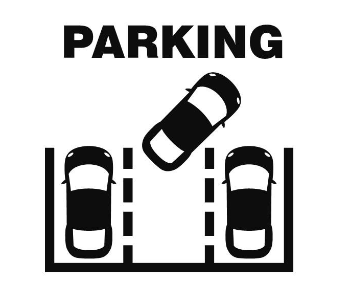

 

 

<h1> &nbsp; &nbsp; Parking-control-api</h1>

 

* **Spring Boot**

* **Spring MVC**

* **Spring Data JPA**

* **Spring Validation**

* **Spring Security**

 
 
    
   
   
   &nbsp;
   &nbsp;
   &nbsp;
   <!-- -->
